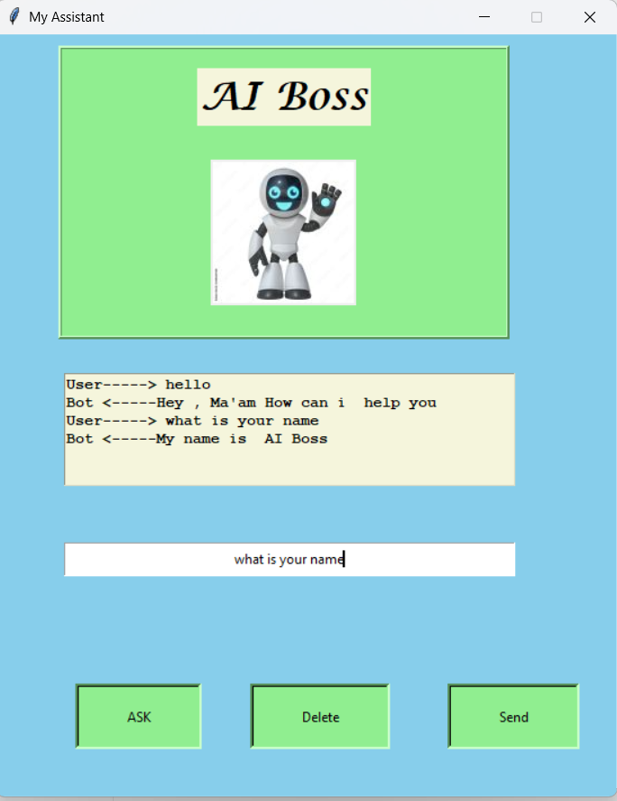

# AI Boss - Desktop Virtual Assistant 🤖

AI Boss is a Python-based desktop virtual assistant featuring a graphical user interface (GUI) built with Tkinter. It uses speech recognition to listen to your commands and text-to-speech to reply back. You can also interact with it using text input!



## ✨ Features
* **Interactive GUI**: A clean and simple user interface to interact with the assistant.
* **Voice Command Support**: Uses a microphone to listen to your voice commands.
* **Text Input**: If you don't want to speak, you can type your commands in the entry box.
* **Text-to-Speech**: The assistant speaks back its responses to you.
* **Task Automation**: Can perform various tasks like:
  * Telling the current time.
  * Opening YouTube, Google, LinkedIn, and Spotify.
  * Casual greetings and conversation.

## 🛠️ Tech Stack & Libraries Used
* **Python 3.x**
* **Tkinter**: For the Graphical User Interface.
* **Pillow (PIL)**: For handling and displaying images in the GUI.
* **SpeechRecognition**: To convert user voice input into text.
* **pyttsx3**: For offline text-to-speech conversion.
* **webbrowser**: To open links in the default browser.

## ⚙️ Prerequisites & Installation

To run this project on your system:

[x]- Make sure you create virtual environemt for installin all libraries easily

[x]-  You just need to run below cmd

pip install -r requirements.txt


# 🤖 AI Boss - Student Utility Assistant (Desktop + Web)


AI Boss is a **Python-based Student Utility Assistant** built in **two versions**:

✅ **Desktop Assistant (Tkinter GUI + Voice Commands)**  
✅ **Web Assistant (Streamlit App for PDF & OCR tools)**  

This project helps students with productivity tasks like **PDF text extraction, image-to-text conversion (OCR), and basic assistant automation**.

---

## 🌟 Project Versions

### 🖥️ 1) Desktop Version (Tkinter Assistant)
A GUI-based virtual assistant that supports **voice and text commands**.

#### ✨ Features
- 🎤 Speech Recognition (Voice Commands)
- ⌨️ Text Input Support
- 🔊 Text-to-Speech Replies
- 🌐 Opens websites (YouTube, Google, Spotify, LinkedIn)
- ⏰ Tells current time
- 💬 Simple chatbot style responses

---

### 🌐 2) Web Version (Streamlit Student Utility App)
A web-based tool where students can upload study material and extract text easily.

#### ✨ Features
- 📄 Upload PDF → Extract Text
- 🖼️ Upload Image → Extract Text (OCR)
- 📥 Download extracted text as `.txt`
- 🌍 Works on Browser (easy to share)

---

## 🚀 Live Demo (Web Version)
🔗 **Streamlit App:** `https://student-utility-assistant.streamlit.app`

Example:
https://your-app-name.streamlit.app

---

## 🖼️ Screenshots

### Desktop Version (Tkinter)


### Web Version (Streamlit)


---

## 🛠️ Tech Stack

### 🔹 Languages
- Python 3.10+

### 🔹 Frameworks / UI
- Tkinter (Desktop GUI)
- Streamlit (Web UI)

### 🔹 Libraries Used
- SpeechRecognition (speech-to-text)
- pyttsx3 (text-to-speech)
- pypdf (PDF text extraction)
- pytesseract (OCR extraction)
- Pillow (Image processing)
- OpenCV (image handling)

---

## 📂 Project Structure

```txt
AI_Assistant_Project/
│
├── GUI.py                  # Desktop Tkinter GUI
├── action.py               # Desktop assistant logic
├── Speech_To_text.py       # Speech recognition module
├── Text_to_Speech.py       # Text-to-speech module
│
├── app.py                  # Streamlit Web App
├── pdf_tools.py            # PDF extraction module
├── ocr_tools.py            # OCR extraction module
│
├── requirements.txt        # Web requirements (Streamlit)
├── requirements_desktop.txt# Desktop requirements (Tkinter)
└── README.md


⭐ Note

This project is continuously improving. Future updates may include translation, question extraction, and advanced note tools.